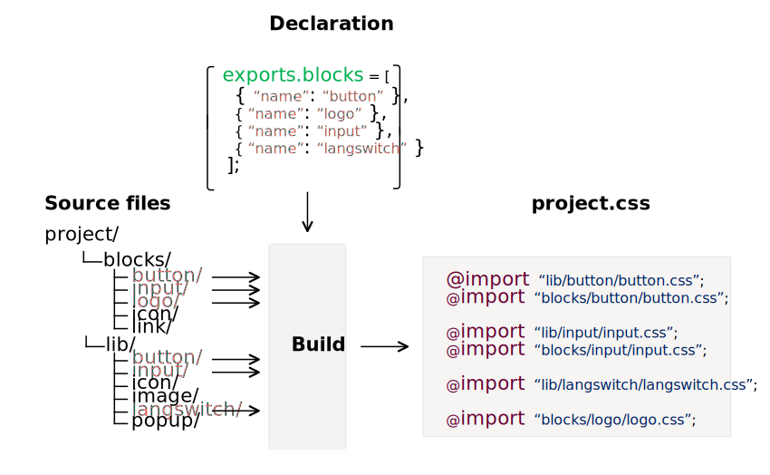

# Методология сборки БЭМ-проекта

Проекты, построенные по БЭМ-методологии, имеют разветвленную файловую структуру. Причина — реализация [блоков](../key-concepts/key-concepts.ru.md#Блок) в БЭМ делится на независимые [файлы-технологии](../key-concepts/key-concepts.ru.md#Технология-реализации).

Пример организации файловой структуры БЭМ-проекта:

```files
blocks/                 # Уровень проекта
    input/              # Директория блока `input`
        input.css       # Реализация блока `input` в технологии CSS
        input.js        # Реализация блока `input` в технологии JavaScript
    icon/
        icon.css

library/                # Уровень библиотеки
    input/
        input.js        # Базовая реализация блока `input` в технологии JavaScript
    button/
```

Чтобы получить из отдельных файлов-технологий общие файлы для всего проекта, необходимо применить сборку. Для этого можно использовать любой из [инструментов сборки](#Инструменты-для-сборки).

> Подробнее о том, зачем разделять реализацию блока на отдельные файлы читайте в разделе [Организация файловой структуры БЭМ-проекта](../filestructure/filestructure.ru.md).

Сборка решает следующие задачи:

* объединяет отдельные [файлы-технологии](../filestructure/filestructure.ru.md#Реализация-блока-разделяется-на-отдельные-файлы), разложенные по файловой структуре проекта;
* подключает в проект только нужные блоки, [элементы](../key-concepts/key-concepts.ru.md#Элемент) и [модификаторы](../key-concepts/key-concepts.ru.md#Модификатор);
* учитывает порядок подключения файлов в проект.

## Этапы сборки

Чтобы из отдельных файлов получить готовую часть проекта ([результат сборки](#Результат-сборки)), например, веб-страницу, необходимо:

* [определить список БЭМ-сущностей для страницы](#Определение-списка-БЭМ-сущностей-для-страницы)
* [описать зависимости между ними](#Описание-зависимостей)
* [определить порядок их подключения](#Определение-порядка-подключения-БЭМ-сущностей-в-сборку)

### Определение списка БЭМ-сущностей для страницы

Первый этап сборки — формирование списка необходимых [БЭМ-сущностей](../key-concepts/key-concepts.ru.md#БЭМ-сущность) для страницы. В БЭМ-методологии такой список называется [декларацией](../declarations/declarations.ru.md). Рассмотрим на примере, для чего и как создается декларация.

**Пример**




В проект подключена библиотека, из которой на странице используются три блока (button, input, langswitch). Вовсе не обязательно включать в сборку всю библиотеку. Достаточно составить список необходимых блоков по описанию страницы. Это можно сделать автоматически или вручную. На основании этого списка в сборку попадут только перечисленные блоки.

Задача декларации определить, что и в каком порядке подключать в сборку.

> Подробнее о [способах построения декларации](../declarations/declarations.ru.md#Способы-получения-декларации).

### Описание зависимостей

На втором этапе сборки описываются зависимости между БЭМ-сущностями. В БЭМ-методологии многие блоки строятся на основании других блоков.


Например, блок формы поиска (`search-form`) построен с помощью блоков `input` (поле ввода) и `button` (кнопка). Не нужно реализовывать эти блоки повторно, если они уже представлены в библиотеке. Блок `search-form` можно построить на их основе.

Чтобы создать блок с помощью другого, уже существующего блока, необходимо указать зависимости между ними. Так, приведенный в примере блок `search-form` зависит от блоков `input` и `button`.

Инструмент сборки получает данные о зависимостях и добавляет все сущности и технологии, необходимые для реализации блока, в процессе сборки. В зависимостях также указывается [порядок подключения сущностей](#Определение-порядка-подключения-БЭМ-сущностей-в-сборку).

Существует несколько способов указать зависимости:

* Непосредственно в коде блока.

  * В CSS зависимости можно определять с помощью директивы [@import](http://htmlbook.ru/css/import).
  * В JavaScript зависимости описываются с помощью модульной системы (например, [AMD](https://github.com/amdjs/amdjs-api/wiki/AMD), [CommonJS](http://www.commonjs.org/)) или импортов ([ECMAScript 2015](http://ecmascript.org)).

* В отдельном файле.

  > В БЭМ-платформе для указания зависимостей используется технология [DEPS](https://ru.bem.info/technology/deps/).

  ```files
  blocks/
      search-form/
          search-form.css
          search-form.deps.js   # Файл с зависимостями блока `search-form`

  ```

### Определение порядка подключения БЭМ-сущностей в сборку

Порядок подключения БЭМ-сущностей в сборку зависит от:

* **указанных зависимостей**

  [Зависимости определяют](https://ru.bem.info/platform/deps/#Синтаксис-depsjs), в каком порядке дополнительная сущность должна попасть в сборку.

* **используемых уровней переопределения**

  Важно соблюдать порядок подключения [уровней](../key-concepts/key-concepts.ru.md#Уровень-переопределения) в сборку. Если сравнить уровни со слоями, то базовый слой – это исходная реализация блока, например, полученная из библиотеки, а каждый последующий слой накладывается сверху и дополняет (наследует) или изменяет базовую реализацию. Поэтому важно, чтобы в сборку сначала попадала исходная реализация, а затем изменения со всех уровней переопределения.

  На схеме показан принцип использования уровней переопределения при сборке: с уровня `common` подключаются общие компоненты для всех платформ, а с уровней `desktop` и `touch` — компоненты, специфичные для каждой из платформ.

  

  Подробно об использовании уровней переопределения читайте в примерах:

  * [Переопределение блоков библиотеки](../filestructure/filestructure.ru.md#Подключение-библиотеки)
  * [Разделение проекта на платформы](../filestructure/filestructure.ru.md#Разделение-проекта-на-платформы)

## Результат сборки

В результате сборки можно получить разные финальные наборы файлов:

* файлы для отдельной страницы (например, `hello.css` и `hello.js`);
* общие файлы для всего проекта (например, один `project.css` и `project.js`);
* файлы для фрагмента страницы, такого как `header` (шапка) или `footer` (подвал), которые используются на разных страницах проекта (например, `header.css` и `header.js`). Общая часть собирается отдельно и подключается при сборке.

Такие наборы файлов, полученные в результате сборки, в БЭМ-методологии принято называть **бандлами**.

> Обратите внимание, сборка рассматривается на примере **страницы** — частного случая бандла.

В файловой структуре результаты сборки отдельных файлов автоматически помещаются в директорию с названием страницы (например, `hello`):

```files
blocks/                 # Директория, содержащая блоки

bundles/                # Директория, содержащая результаты сборки (опционально)
    hello/              # Директория страницы `hello` (создается вручную)
```

Пример файловой структуры БЭМ-проекта до выполнения сборки:

```files
blocks/                 # Директория, содержащая блоки

bundles/                # Директория, содержащая результаты сборки
    hello/              # Директория страницы `hello`
        hello.decl.js   # Список БЭМ-сущностей, необходимых для страницы `hello`
```

Пример файловой структуры БЭМ-проекта после выполнения сборки:

```files
blocks/                 # Директория, содержащая блоки

bundles/                # Директория, содержащая результаты сборки
    hello/              # Директория страницы `hello`
        hello.decl.js   # Список БЭМ-сущностей, необходимых для страницы `hello`
        hello.css       # Собранный CSS-файл страницы `hello`
        hello.js        # Собранный JavaScript-файл страницы `hello`
```

При сборке в проект могут быть включены:

* все БЭМ-сущности с файловой структуры проекта (что значительно увеличивает объем результирующего кода);
* только необходимые для построения страницы БЭМ-сущности в строго определенном порядке.

## Инструменты для сборки

Выбор инструмента для сборки зависит от сложности БЭМ-проекта, наличия в нем уровней переопределения и использования зависимостей.

БЭМ-методология не ограничивает выбор инструмента — можно использовать любые сборщики (например, Gulp, Grunt, Brunch, Broccoli), отвечающие требованиям проекта.

> Пример сборки БЭМ-проекта с помощью [Gulp](http://gulpjs.com/) — [Декларативный JavaScript по БЭМ](https://ru.bem.info/forum/-696/).

В БЭМ-платформе используется сборщик [ENB](https://ru.bem.info/tools/bem/enb-bem/), который подходит для сборки БЭМ-проектов любой сложности.

> Пример сборки БЭМ-проекта с помощью [ENB](https://ru.bem.info/tools/bem/enb-bem/) — [Создаем проект по БЭМ](https://ru.bem.info/tutorials/start-with-project-stub/).
